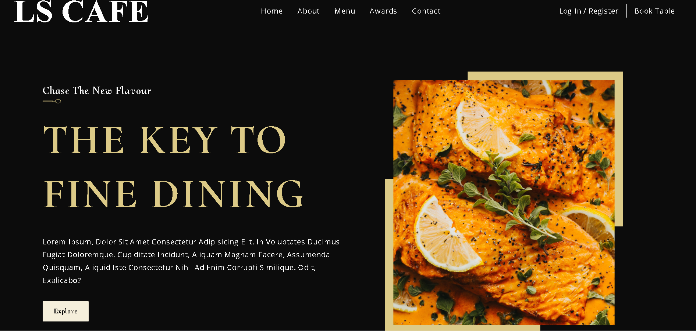
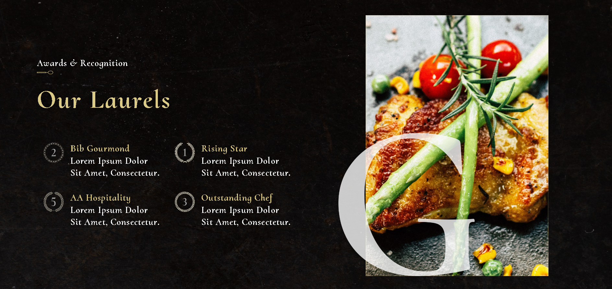
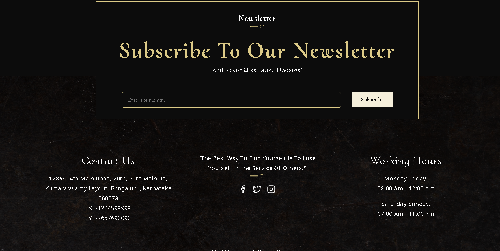

Find The Live Website Here - https://githarsh19.github.io/LScafe/

Find The Figma Link Here - https://www.figma.com/file/ahcCECAd59eZtQjLtwGOmD/Modern-UI%2FUX%3A-LS-CAFE-INTERNSHIP?node-id=0%3A21&t=oC1a1ixZIYJbxOLW-1

## Screen Shots:
<div align="center">
  
  
  ***
  
  
  
  ***
  
  
</div>

### Steps to Run on Local Machine

***

#### Note: You need to have Node.Js installed in your Local Machine if not, first install it from <a href="https://nodejs.org/en/">here</a>.
##### Step 1) Clone This Repository
##### Step 2) Open Restaurant-App cloned Directory in Command Prompt and run the following command (It will install all the Dependencies needed to run):
```
npm i
```
#### Step 3) Once all the dependencies are successfully installed, Run the following Command:
```
npm start
```
#### Step 4) Once the above steps are done you should get the message:
    You can now view client in the browser.
      Local:            http://localhost:3000 
      webpack compiled successfully
#### Step 5) Open Browser and go to http://localhost:3000

***
<h1 align="center">Thank You</h1>
